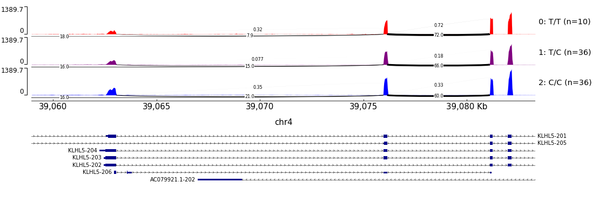

# GenometracksByGenotype
Helper script to plot molQTLs. Normalize and group bigwigs by genotype.

## Dependencies
The python script requires a bunch of libraries:
- pyVCF
- pyBigWig
- numpy

Additionally, the intended use of the python script is to prepare bigwigs and track files for plotting with pyGenomeTracks.

All of the dependencies, and pyGenomeTracks, can be installed with the conda evnironment included:

```bash
conda env create -f GenometracksByGenotype.conda_env.yml
```

The pyGenomeTracks included in this conda environment comes from my labmate's
[fork](https://github.com/Zepeng-Mu/pyGenomeTracks) for which he defined a new
type of track for making sashimi-splicing plots. See below for an example.

## Usage

Input requirements are a vcf, and bigwig files for each individual to plot. The bigwig files are matched to sample names either by a tab delimited input (TODO list), or by a glob pattern if the sample names are named similarly to the test example. To convert bam to bigwig, there is a helper script in this repository (`BamToBigwig.sh`).

Use the main script with the help flag for more info.

```
python NormalizedBigwigsByGenotype.py -h
```

Also, included in `test_data/` is data that I realigned from Grubert et al. Specifically, it is H3K4me3 ChIP-Seq data from a small region on chr4, and we will use it to plot a H3K4me3 QTL. In this case, I also used the optional argument `--TracksTemplate` to specify a pyGenomeTracks `.ini` configuration file template. If you do not specify this, a reasonable default ini file will by output to `{OutputPrefix}output_tracks.ini`. There are a couple different templates included in `tracks_template/` for different plotting styles. The track template style used below will plot averaged signal by genotype, and also each individual signal, so the script also needs to output bigwigs for each genotype with the `--OutputNormalizedBigwigsPerSample` flag.

```bash
# Make a dir to store results
mkdir -p test_results

# Run the main python script
python NormalizedBigwigsByGenotype.py test_data/1KG.Subset.vcf.gz chr4:173807 chr4:117320-138022 "test_data/bigwigs/*" --Normalization None --BigwigListType GlobPattern --OutputPrefix test_results/ --TracksTemplate tracks_templates/CoveragePerIndAndAverage.ini --OutputNormalizedBigwigsPerSample

# Run pyGenomeTracks
# Notice the usage of the tracks file generated by the python script. Also, to
# make this plot, we will concatenate tracks to display genes and peaks with
# bash process substitution.
pyGenomeTracks --tracks <(cat test_results/output_tracks.ini PremadeTracks/genes.hg38.ini test_data/GruberH3K4me3.tracks.ini) --out test_results/test.png --region chr4:118,320-138,022
```

The following image is produced...


Here is another example using Geuvadis RNAseq bigiwgs and QTLtools style phenotype bed
file of splicing PSI values to show a splicingQTL using a sashimi-splicing
plot.  The bed file for plotting sashimi arcs is specifed with
`--BedfileForSashimiLinks`.

```bash
# Make a dir to store results
mkdir -p test_results

# Run the main python script:
# note the use of `tabix` (a samtools tool for fast access to specific region
# of a compressed and indexed bed file) in the process substitution so that the
# script does not need to read in a potenetially large bed file. In this case,
# within the process substitution pipe, we can also use tools like sed to filter
# for rows, like introns within a particular intron cluster.
python NormalizedBigwigsByGenotype.py test_data/sQTL.vcf.gz chr4:39054234 chr4:39,058,957-39,083,297  "test_data/RNASeqSubset_bigwigs/*.bw" --Normalization None --BigwigListType GlobPattern  --OutputPrefix test_results/  --OutputNormalizedBigwigsPerSample --BedfileForSashimiLinks <(tabix -h test_data/Splicing_test.PSI.bed.gz chr4:39,058,957-39,083,297 | sed -n '1p;/clu_10051/p')

# Run pyGenomeTracks
pyGenomeTracks --tracks <(cat test_results/output_tracks.ini PremadeTracks/transcripts.hg38.ini) --out test_results/test_splicing.png --region chr4:39,058,957-39,083,297
```
The following image is produced...



## Usage as module
the `NormalizedBigwigsByGenotype.py` can also be used as a module, which could be useful for plotting lots of things from within python. But I don't think we can use the bash process subtitution tricks when using the script this way, so there might be better ways to use this script effectively... In any case, here is an example python script to that uses the script as an imported module:

```python
import NormalizedBigwigsByGenotype

MyArgs = 'test_data/1KG.Subset.vcf.gz chr4:173807 chr4:117320-138022 test_data/bigwigs/*.bw --Normalization None --BigwigListType GlobPattern --OutputPrefix test_results/ --TracksTemplate tracks_templates/tracks.ini.template3.txt --OutputNormalizedBigwigsPerSample'.split(' ')
parsed_args = NormalizedBigwigsByGenotype.parse_args(MyArgs)
NormalizedBigwigsByGenotype.main(parsed_args)
```
