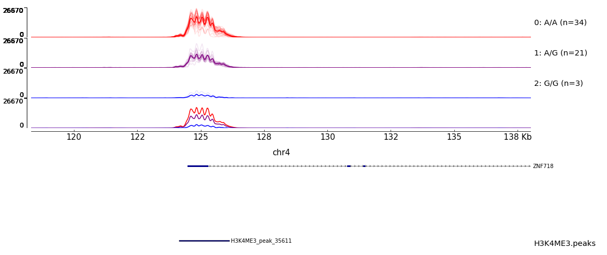

# GenometracksByGenotype
Helper script to plot molQTLs. Normalize and group bigwigs by genotype.

## Dependencies
The python script requires a bunch of libraries:
- pyVCF
- pyBigWig
- numpy

Additionally, the intended use of the python script is to prepare bigwigs and track files for plotting with pyGenomeTracks.

All of the dependencies, and pyGenomeTracks, can be installed with the conda evnironment included:

```bash
conda env create -f GenometracksByGenotype.conda_env.yml
```

## Usage

Input requirements are a vcf, and bigwig files for each individual to plot. The bigwig files are matched to sample names either by a tab delimited input (TODO list), or by a glob pattern if the sample names are named similarly to the test example. To convert bam to bigwig, there is a helper script in this repository (`BamToBigwig.sh`).

Use the main script with the help flag for more info

```
python NormalizedBigwigsByGenotype.py -h
```

Also, included in `test_data/` is data from Grubert et al. Specifically, it is H3K4me3 ChIP-Seq data on chr19, and we will use it to plot a H3K4me3 QTL.

```bash
# Make a dir to store results
mkdir test_results

# Run the main python script
python NormalizedBigwigsByGenotype.py test_data/GEUVADIS.vcf.gz chr19:1489771 chr19:1488527-1492832 "test_data/bigwigs/*.bw" --Normalization WholeGenome --BigwigListType GlobPattern --OutputPrefix test_results/ --TracksTemplate tracks_templates/tracks.ini.template3.txt --OutputNormalizedBigwigsPerSample

# Run pyGenomeTracks
# Notice the usage of the tracks file generated by the python script. Also, to
# make this plot, we will concatenate tracks to display genes and peaks.
pyGenomeTracks --tracks <(test_results/output_tracks.ini test_data/gtf_tracks.ini test_data/GruberH3K4me3.tracks.ini) --out test_results/test.pdf --region chr19:1488527-1492832
```

The following image is produced...


