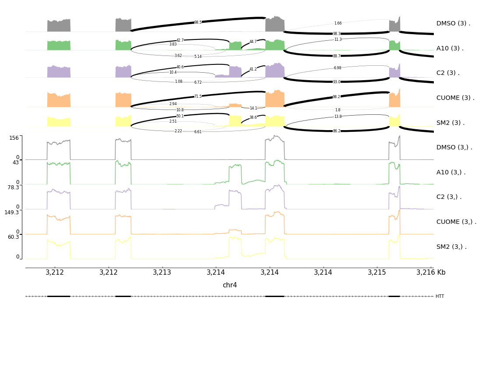

# GenometracksByGenotype
Helper scripts to plot stuff with pyGenomeTracks. Plot molQTLs, or other data in useful ways, averaging coverage by groups.

## Dependencies
The python script requires a bunch of libraries, including:
- pyVCF
- pyBigWig
- numpy
- pandas
- jinja2
- colorbrewer

Additionally, the intended use of the python script is to prepare bigwigs and track files for plotting with pyGenomeTracks.

All of the dependencies, and pyGenomeTracks, can be installed with the conda evnironment included:

```bash
conda env create -f GenometracksByGenotype.conda_env.yml
```

The pyGenomeTracks included in this conda environment comes from my labmate's
[fork](https://github.com/Zepeng-Mu/pyGenomeTracks) for which he defined a new
type of track for making sashimi-splicing plots. See below for an example.

## Usage

### Overview

The most useful/main script for this repo is AggregateBigwigsForPlotting.py, which is useful for making averaged bigwigs by groups (where groups can be replicates, or all samples corresponding to a particular genotype, for example), and creating an ini file filled in (using a jinja2 template) with the newly created averaged bigwig tracks for immediate use with pyGenomeTracks with minimal or no manual editing for ini files.

the main script with the help flag for more info... And also see the examples section below:

```
python AggregateBigwigsForPlotting.py -h
```

```
usage: AggregateBigwigsForPlotting.py [-h]
                                      [--BigwigList {"<GlobPattern>",<KEYFILE>}]
                                      --Region <CHR>:<START>-<STOP>
                                      [--VCF <VCFFile>] [--SnpPos <CHR>:<POS>]
                                      [--SnpName <CHR>:<POS>:<REF>:<ALT>]
                                      --BigwigListType {KeyFile,GlobPattern}
                                      [--Normalization {<BEDFILE>,None,WholeGenome,PlotWindowCoverage}]
                                      [--OutputPrefix OUTPUTPREFIX]
                                      [--BedfileForSashimiLinks BEDFILEFORSASHIMILINKS]
                                      [--GroupSettingsFile GROUPSETTINGSFILE]
                                      [--OutputNormalizedBigwigsPerSample]
                                      [--TracksTemplate <FILE>]
                                      [--IGVSessionOutput] [--JinjaDfOutput]
                                      [--IGVSessionTemplate <FILE>]
                                      [--FilterJuncsByBed <FILE>]
                                      [--NoSashimi] [--Bed12GenesToIni <FILE>]
                                      [--GenotypeBrewerPalettes <string>]
                                      [--GenotypeCustomPalette <#NNNNNN,#NNNNNN,#NNNNNN,#NNNNNN>]
                                      [--Workdir <path>] [-v] [-q]

Outputs:
    <OutputPrefix>_output_0.bw
    <OutputPrefix>_output_1.bw
    <OutputPrefix>_output_2.bw
    <OutputPrefix>_output_tracks.ini
    <OutputPrefix>_PerInd_<Genotype>_<Sample>.bw

Note that bigwigs must not contain NaN values. Use 0 to denote no coverage. This can be accomplished with bedtools genomecov with -bga option then convert bedGraphToBigWig. See helper script in this repo.
--File or autodetect for samples to files

optional arguments:
  -h, --help            show this help message and exit
  --BigwigList {"<GlobPattern>",<KEYFILE>}
                        If using with the --BigwigListType KeyFile option, a
                        tab delimited text file with samples in the first
                        column and a path to the input bigwig files in the
                        second column. Alternatively, if using with the
                        --BigwigListType GlobPattern option, use a wildcard
                        glob of bigwig files, and the samples will be inferred
                        by searching the expanded filepaths for strings that
                        match samples in the VCF. Note that using this
                        wildcard method requires you to enclose the grob
                        pattern in quotes, since this script needs to parse
                        the grob pattern with python. Excluding quotes will
                        immediately expand the grob pattern by the shell.
                        Example1: MySampleToBigwigKey.tsv --BigwigListType
                        KeyFile Example2: "./Bigwigs/*/Coverage.bw"
                        --BigwigListType GlobPattern where the * expansion may
                        be sample names, which are automatically matched (with
                        some wiggle room). Using a keyfile is obviously more
                        robust, as the glob pattern requires some guessing to
                        match files to samples. For convenient use with
                        1000Genomes project samples, this sripts will match
                        samples by searching filenames for 5 digit patterns
                        that match sample naming scheme used in 1000Genomes
                        project. For example: a file named
                        ./MyBigwigs/GM19137.bw will be matched to the sample
                        HG19137 because of the 19137 substring match. If a
                        KeyFile is provided, it should be a 2+ column tab
                        delimited file where the first 5 columns defined as:
                        1: sample ID (must match vcf sample if attempting to
                        average by genotype) 2: bigwig filepath 3: group_label
                        (optional) 4: ""|"+"|"-" for strand. (Do not actually
                        enter quotes.. optional, default is "" for unstranded.
                        this is useful for plotting stranded coverage. Columns
                        past these 4 will be ignored
  --Region <CHR>:<START>-<STOP>
                        Region to output
  --VCF <VCFFile>       gzipped and tbi indexed vcf file with sample genotypes
  --SnpPos <CHR>:<POS>  Snp position. Position should be one-based, same as in
                        vcf
  --SnpName <CHR>:<POS>:<REF>:<ALT>
                        Snp name. Name should have the following format:
                        chr:position:Ref:Alt
  --BigwigListType {KeyFile,GlobPattern}
                        Required. Define how the bigwig list positional
                        argument is specified. The GlobBattern option requires
                        use of --VCF option
  --Normalization {<BEDFILE>,None,WholeGenome,PlotWindowCoverage}
                        A bed file of regions to use for sample-depth
                        normalization. The within-sample total coverage over
                        the regions will be used to normalize each sample. If
                        'None' is chosen, will not perform any normalization.
                        If 'WholeGenome' is used, will use whole genome.
                        'PlotWindowCoverage' normalizes tracks to total
                        coverage specified in --Region. I haven't ever tested
                        the <BEDFILE> option. (default: None)
  --OutputPrefix OUTPUTPREFIX
                        Prefix for all output files (default: ./)
  --BedfileForSashimiLinks BEDFILEFORSASHIMILINKS
                        QTLtools style bed or bed.gz file with header for
                        samples (sample names must match vcf) and values to
                        calculate average PSI per genotype. (default: None)
  --GroupSettingsFile GROUPSETTINGSFILE
                        Requires use of --BigwigListType KeyFile. This option
                        specifies tab delimited file with one row per
                        Group_label to add extra plotting settings for each
                        group. Columns are as follows: 1: Group_label (must
                        match a Group_label in the KeyFile) 2: Group_color
                        (optional). Hex or rgb colors to plot potentially plot
                        each group as defined in the output ini 3: BedgzFile
                        (optional). Any bedgz file provided in this column
                        will take precedent over bedgz files provided to the
                        --BedfileForSashimiLinks option. If a group settings
                        file is provided only groups described in that file
                        will be plotted. Additionally, tracks will be plotted
                        in the order they are listed in this file
  --OutputNormalizedBigwigsPerSample
                        Output normalized bigwigs for each sample. This will
                        be required if the ini template chosen plots coverage
                        of individual samples.
  --TracksTemplate <FILE>
                        A jinja template for a tracks file for pyGenomeTracks
                        customization. An example is included. Template
                        variables allowed are 'OutputPrefix', 'HomoRefTitle',
                        'HetTitle', 'HomoAltTitle', and 'YMax'. If this
                        argument is provided, the template file will be
                        populated with the template variables to create a
                        tracks file that can be used for pyGenomeTracks. If
                        this argument is not provided, will output a very
                        basic tracks file that can be used for pyGenomeTracks
  --IGVSessionOutput    Flag to create a tracks.xml IGV session file (see http
                        s://software.broadinstitute.org/software/igv/Sessions)
                        output to easily browse aggregated bigwigs with IGV.
  --JinjaDfOutput       Flag to create a DF.tsv file to see the dataframe
                        object (accessible in jinja template as variable named
                        'DF') used to create the ini file
  --IGVSessionTemplate <FILE>
                        A jinja template for a IGV session xml file. The
                        template file will be populated with the DF variables
                        to create the optional output file specified by
                        IGVSessionOutput. If this argument is not provided,
                        will basic template will be chosen
  --FilterJuncsByBed <FILE>
                        An optional bedfile of junctions to filter for
                        inclusion. If none is provided, all juncs will be
                        included
  --NoSashimi           Flag to disable sashimi plots. Default is to include
                        sashimi plot if junction file(s) are provided (as a
                        column in a KeyFile, or with the
                        --BedfileForSashimiLinks argument) and there are juncs
                        in the plotting region. This flag disables sashimi
                        plots regardless
  --Bed12GenesToIni <FILE>
                        An optional bed12 genes files. If provided, will add a
                        track for these genes at the end of the ini output
                        file
  --GenotypeBrewerPalettes <string>
                        A colorbrewer palette to use for genotypes. Options:
                        ['Accent', 'Blues', 'BrBG', 'BuGn', 'BuPu', 'Dark2',
                        'GnBu', 'Greens', 'Greys', 'Oranges', 'OrRd',
                        'Paired', 'Pastel1', 'Pastel2', 'PiYG', 'PRGn',
                        'PuBu', 'PuBuGn', 'PuOr', 'PuRd', 'Purples', 'RdBu',
                        'RdGy', 'RdPu', 'Reds', 'RdYlBu', 'RdYlGn', 'Set1',
                        'Set2', 'Set3', 'Spectral', 'YlGn', 'YlGnBu',
                        'YlOrBr', 'YlOrRd', 'RdPrBlu']
  --GenotypeCustomPalette <#NNNNNN,#NNNNNN,#NNNNNN,#NNNNNN>
                        string of 4 commad delimited HEX color codes to use
                        for genotypes: (1) ref/ref, (2) ref/alt, (3) alt/alt,
                        and (4) ungenotyped. If provided, this argument takes
                        precedence over --GenotypeBrewerPalette
  --Workdir <path>      An optional path to set as workdir before executing
                        main script function. Could be useful, for example, if
                        bigwig file list uses relative file paths from a
                        different directory
  -v, --verbose         verbose output (repeat for increased verbosity)
  -q, --quiet           quiet output (show errors only)
```

### Examples

I included some example data in this repo, to demonstrate how to use that main script with pygenometracks. Between these examples, you can get the idea of most all of the optional arguments. First, let's create a directory to save results to... All of the commands in these examples are executed from the repo's root directory.

```bash
# Make a dir to store results
mkdir -p tmp
```
In all of these examples, I will use the `--OutputPrefix tmp/tmp`, so in each example, a lot of the output files will rewrite over the previous example. So be sure to re-run the python script immediately before plotting with `pyGenomeTracks` to ensure the correct `tmp/tmptracks.ini` file is used by pyGenomeTracks with all the correct datafiles for each track.

I have already provided the data required for these examples in this repo, including bigwig files. For creating bigwig files from your own data, you can also use my helper script included in the repo (`BamToBigwig.sh`).

#### Example1: simple plot at HTT gene

In this example, we have short read RNAseq data from 3 replicates each of cells treated with the following splice modifying small molecules: (1) A10, a risdiplam analog, (2) CUOME, another risdiplam analog, (3) SM2, a branaplam analog, and (4) DMSO control. We will use the required `--BigwigList` argument to provide a [4 column tab delimited text file](https://github.com/bfairkun/GenometracksByGenotype/blob/master/test_data/bigwig.list.OnlyFirstExample.tsv) (with headers, which should be self explanatory for what goes in each column) that maps out which samples belong to the same group for averaging coverage signal. Since RNAseq data is unstranded, coverage is be summarised for each sample with a single bigwig file, and the fourth column is left blank or as "." to denote unstranded data. See later examples for plotting stranded data. When troubleshooting, the verbosity can be increased `-v`, `-vv`, `-vvv`.

```bash
# Run script
python AggregateBigwigsForPlotting.py --BigwigList test_data/bigwig.list.OnlyFirstExample.tsv --BigwigListType KeyFile --OutputPrefix tmp/tmp --Region chr4:3,211,727-3,215,527 -v

# Run pygenometracks with the newly created ini file
pyGenomeTracks  --region chr4:3,211,727-3,215,527 --tracks tmp/tmptracks.ini -o tmp/example_HTT_simple.png
```

The following image is produced...


#### Example2: decorating the HTT example

In this example, we will utilize the same data... Using the `--GroupSettingsFile` optional argument, we can provide [a second tab seperated file](https://github.com/bfairkun/GenometracksByGenotype/blob/master/test_data/Example_HTT_data/GroupsFile.A.tsv) with 4 columns and a header. In this example, we left the third and fourth column blank (will explain in later examples), and only left the first two columns to denote what colors to use for what groups. Groups that are not in this groups file are not plotted, and notice that the groups will be plotted in the order they appear in that file. We also use the `--BedfileForSashimiLinks` to specify a bed file (same format as QTLtools phenotype table) that contains quantitative splicing information for each splice junction bed entry for each sample. This splicing information will be averaged by group to create a sashimi plot. The sample columns in this file must match the samples provided in the `--BigwigList` file. If the bedfile is tabix indexed (as is required for QTLtools), the script will use the index for efficiency if the bedfile is really big. Also, here I am using the `--Bed12GenesToIni` argument to specify a bed12 file to add to the ini file. In this repo I have included some useful bed12 files for this, to make it easier to plot annotated genes.

```bash
python AggregateBigwigsForPlotting.py --BigwigList test_data/bigwig.list.OnlyFirstExample.tsv --BigwigListType KeyFile --OutputPrefix tmp/tmp   --Region chr4:3,211,727-3,215,527  --GroupSettingsFile test_data/Example_HTT_data/GroupsFile.A.tsv --Bed12GenesToIni PremadeTracks/gencode.v26.FromGTEx.genes.bed12.gz --BedfileForSashimiLinks test_data/Example_HTT_data/SplicingTable.bed.gz

pyGenomeTracks  --region chr4:3,211,727-3,215,527 --tracks tmp/tmptracks.ini -o tmp/example_HTT_sashimi.png
```
The following image is produced...



#### Example3: HTT with supergroups

In this example, we will use the same data, and some more data at the same locus, including a titration series of (1) C2C5, (2) Risdiplam, and (3) Branaplam. So since we have more data, we will need a [new bigwig file list](https://github.com/bfairkun/GenometracksByGenotype/blob/master/test_data/bigwig.list.tsv) that includes this data. I have often found it useful to plot some of these groups of data overlaid on the same track, for easier visual comparison. We can specify how we want this done by the 'Supergroups' column in this [new GroupSettingsFile](https://github.com/bfairkun/GenometracksByGenotype/blob/master/test_data/Example_HTT_data/GroupsFile.B.tsv). Again, since only some groups are in this group settings file, only those groups will be plotted. Also in this group settings file, we can provide bed file for each group (or the same one for all groups if it contains all the samples, as I have done here) in place of the `--BedfileForSashimiLink` argument. This is particularly useful if you have samples with the same name, but that belong to different groups and you have different splicing quantification bed files for each (see the TTC38 example). If bedfiles are provided for sashimi plots, sashimi tracks will by default be included in the ini unless you use the `--NoSashimi` flag as I have done in this example. Also, because I am plotting things differently than the previous example, with some groups overlaid on top of others, I have to use a different jinja template (specified with the `--TracksTemplate`) to create the ini file than the default. I have included some other jinja templates in this repo. If you want a different plot style than the templates I have included, it may be useful to know what data is accessible by the template engine. Most of the data that available for the jinja to fill in to the template is in the pandas dataframe object named "DF", which you might want to see by looking at the `tmp/tmpDF.tsv` file output after using the `--JinjaDfOutput` flag. Finally, I have also used the `--IGVSessionOutput` flag to turn on outputting an xml file, which uses a different jinja template specified by `--IGVSessionTemplate` argument to produce an xml file that can be opened in IGV to view all of the sample tracks. In this example, I use relative filepaths in the BigwigList, so the same relative filepaths are filled in the jinja template to make the `tmp/tmptracks.xml` output. To make the relative paths valid to IGV, I need to move this file before opening in IGV.

```bash
 python AggregateBigwigsForPlotting.py --BigwigList test_data/bigwig.list.tsv --BigwigListType KeyFile --OutputPrefix tmp/tmp   --Region chr4:3,211,727-3,215,527  --GroupSettingsFile test_data/Example_HTT_data/GroupsFile.B.tsv --NoSashimi --TracksTemplate tracks_templates/GeneralPurposeColoredByGenotypeWithSupergroups.ini --Bed12GenesToIni PremadeTracks/gencode.v26.FromGTEx.genes.bed12.gz --JinjaDfOutput --IGVSessionOutput --IGVSessionTemplate tracks_templates/GeneralPurpose.xml

pyGenomeTracks  --region chr4:3,211,727-3,215,527 --tracks tmp/tmptracks.ini -o tmp/example_HTT_overlaidtracks.png
```

The following image is produced...


Now let's open that xml file in IGV.

```bash
mv tmp/tmptracks.xml ./
```

Now opening that file as a session in IGV I see this:


...One day, if I find a need for it in my own work, I might make more useful xml templates.

#### Example4: HTT after renormalizing coverage

In the previous examples, each track is just the average of all the tracks in the group. This might be reasonable provided that the input bigwigs are already normalized for total read depth/coverage. But what if they aren't. Well I suggest remaking bigwigs that are normalized for coverage... But another option is to have the script do the re-normalizing for you before the average is computed. This can be done with the `--Normalization` argument... If you do `--Normalization WholeGenome`, the coverage of each sample in the plot window will be re-normalized to the total coverage across the whole genome before computing the group average track. If you do `--Normalization PlotWindowCoverage`, the normalization is done relative to the total coverage in the `--Region`. In this case, this is kind of useful if I just want to focus on interpretting the coverage at the HTT poison exon as a measure of PSI (PercentSplicedIn), which is difficult to do visually because biologically HTT gets down-regulated when HTT poison exon usage is high. By re-normalizing each track to the total coverage in this HTT gene window, the actual poison exon PSI usage of each of the tracks becomes more visually obvious, despite HTT's down-regulation.

```bash
 python AggregateBigwigsForPlotting.py --BigwigList test_data/bigwig.list.tsv --BigwigListType KeyFile --OutputPrefix tmp/tmp   --Region chr4:3,211,727-3,215,527  --GroupSettingsFile test_data/Example_HTT_data/GroupsFile.B.tsv --NoSashimi --TracksTemplate tracks_templates/GeneralPurposeColoredByGenotypeWithSupergroups.ini --Normalization PlotWindowCoverage  --Bed12GenesToIni PremadeTracks/gencode.v26.FromGTEx.genes.bed12.gz

pyGenomeTracks  --region chr4:3,211,727-3,215,527 --tracks tmp/tmptracks.ini -o tmp/example_HTT_overlaidtracks_renormalized.png
```

The following image is produced...


#### Example5: an hQTL in ZNF18

In this example, I will use H3K27Ac data from [Grubert et al](https://pubmed.ncbi.nlm.nih.gov/26300125/) at the ZNF18 promoter. Samples with different genotypes at a particular SNP have different H3K27Ac activity at this locus. To plot the average coverage of this H3K27Ac peak, segregated by genotype at this hQTL, I suppose you could create a new groups file by different genotypes and overlay the tracks with an appropriate ini. This script can do that under the hood by subgrouping the groups by genotype if `--VCF` and `--SnpPos` are included. An optional `--SnpName` argument can also be included to distinguish SNPs that can't be uniquely identified in the VCF if SnpPos alone is specified (SnpName must matche the 3rd column in the VCF). Also, rather than supplying a file to the `--BigwigList` argument, you can supply a quoted glob pattern if all the samples (sample name must be included somewhere in the filepath for each glob hit) if you use `--BigwigListType GlobPattern`. I don't recommend this, since filename matching might not be precise, and there isn't much flexibility for plotting multiple tracks in the same plot (see next example), but nonetheless, I'll demonstrate the capability here:

```bash
 python AggregateBigwigsForPlotting.py --BigwigList "test_data/Example_ZNF718_data/bigwigs/H3K27AC_ChIPseq_*.bw" --BigwigListType GlobPattern --VCF test_data/SNPs.vcf.gz --SnpPos chr4:173807 --OutputPrefix tmp/tmp   --Region chr4:123,137-127,511 --Bed12GenesToIni PremadeTracks/gencode.v26.FromGTEx.genes.bed12.gz

 pyGenomeTracks  --region chr4:123,137-127,511 --tracks tmp/tmptracks.ini -o tmp/example_ZNF18_hQTL.png
```

The following image is produced...


#### Example6: ZNF18 hQTL and eQTL

In this example, I will expand on the previous example by also included an RNA-seq track. Providing a globpattern to specify all the bigwigs does not convey which bigwigs belong to the H3K27Ac track versus the RNAseq track. Therefore, using [the BigwigList](https://github.com/bfairkun/GenometracksByGenotype/blob/master/test_data/bigwig.list.tsv) with [this GroupSettingsFile](https://github.com/bfairkun/GenometracksByGenotype/blob/master/test_data/Example_ZNF718_data/GroupsFile.A.tsv) is necessary. Also, if you don't like the red/purple/blue color scheme for QTLs, you can specify your own as I have done here with `--GenotypeCustomPalette`. Finally, note that I used the `--OutputNormalizedBigwigsPerSample` in combination with a different `--TracksTemplate` jinja template ini file to plot each sample in a lighter transparency overlaid on top of the group/genotype average.

```bash
 python AggregateBigwigsForPlotting.py --BigwigList test_data/bigwig.list.tsv --BigwigListType KeyFile --VCF test_data/SNPs.vcf.gz --SnpPos chr4:173807 --OutputPrefix tmp/tmp   --Region chr4:123,137-127,511  --GroupSettingsFile test_data/Example_ZNF718_data/GroupsFile.A.tsv --OutputNormalizedBigwigsPerSample --TracksTemplate tracks_templates/GeneralPurposeColoredByGenotypeWithPerIndCoverage.ini  --Bed12GenesToIni PremadeTracks/gencode.v26.FromGTEx.genes.bed12.gz --NoSashimi --GenotypeCustomPalette "#1b9e77,#d95f02,#7570b3,#636363"

  pyGenomeTracks  --region chr4:123,137-127,511 --tracks tmp/tmptracks.ini -o images/example_ZNF_example2.png
```

The following image is produced...


#### Example7: TTC38 sQTL

In this example, I will demonstrate that the sub-grouping by genotype under the hood can also be done to plot sashimi plots that nicely highlight sQTLs. I will be plotting data at a different locus, segregated by genotype for a sQTL in the TTC38 gene. Also note that the SNP location is included in the ini file, as shown by the vertical line in the plot. Furthermore, I have defined the genotype colors using a colorbrewer palette with `--GenotypeBrewerPalettes` argument, and I have used the `--FilterJuncsByBed` argument to tell the script to only include sashimi arcs that are present in both the provided bedfile of quantitative data and the `--FilterJuncsByBed` file... Too sashimi many arcs can distract from the sQTL junctions of interest. Lastly, I'll highlight a different premade track for the `--Bed12GenesToIni` argument that I included in this repo: a bed file of all Gencode transcripts, colored by their transcript type (where transcripts tagged with "protein_coding" are colored blue while transcripts tagged with "nonsense_mediated_decay" are tagged red). In this example, I am plotting both steady-state RNA-seq coverage, and nascent RNA-seq coverage, in which the down-regulating affect of the sQTL is less apparent than in steady-state RNA as expected, despite the splicing effect being obvious present in both. Finally, note that the naRNA data is stranded. Each sample in the BigwigList file has one row for "+" strand bigwig, and another for the "-" strand bigiwg.

```bash
 python AggregateBigwigsForPlotting.py --BigwigList test_data/bigwig.list.tsv --BigwigListType KeyFile --VCF test_data/SNPs.vcf.gz --SnpPos chr22:46291323  --OutputPrefix tmp/tmp   --Region chr22:46,289,343-46,294,094  --GroupSettingsFile test_data/Example_TTC38_data/GroupsFile.A.tsv --Bed12GenesToIni PremadeTracks/Reference.Transcripts.colored.bed.gz --GenotypeBrewerPalettes 'Reds' --FilterJuncsByBed test_data/Example_TTC38_data/JuncsToInclude.bed

 pyGenomeTracks  --region chr22:46,289,343-46,294,094 --tracks tmp/tmptracks.ini -o tmp/example_TTC38.png
```

The following image is produced...


### More possibilities

the `AggregateBigwigsForPlotting.py` can also be used as a module, which might be useful for plotting lots of things from within python. `AggregateForQTLMetaplot.py` is an example python script to that uses the script as an imported module and used to repeatedly call the main function in `AggregateBigwigsForPlotting.py` to create a a metaQTL plot (ie, take the high/high genotypes at hundreds of hQTLs and average them, and plot alongside the average of the med/med genotypes, and the low/low genotypes).

Also, If there is something about the plot styles that you don't like, create a new ini file template and consider sharing/pull-requesting.
